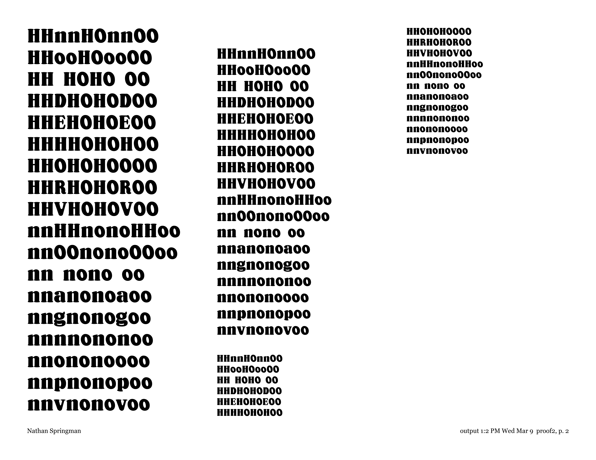
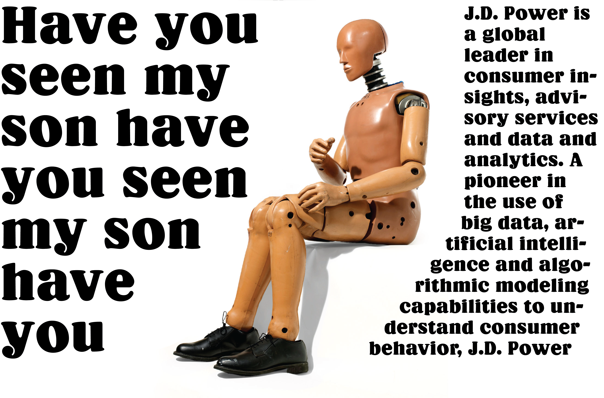

# Semester documentation

# Pixel typeface

For the pixel typeface, my initial inclination was to create something that was very readable instead of decorative. I looked at some of the fonts on the original Macintosh for inspiration on how to approach some of the design challenges.

It's hard to really classify this font, but my approach was to make a fairly light or text-weight slab serif. Most every form is two pixels/blocks wide.

Generally, development was straightforward. The only big shift in approach was wether to have serifs be one or two pixels thick.

Nearly every form in the typeface is two blocks wide. From this standpoint, it made sense to have the serifs two blocks wide. The above specimen compares the heavier and lighter serifs, and the heavier seems to add too much weight to the overall texture. As such, the lighter serifs (lower of above) were kept.

Final set of letters.

# Revival - Sloopy

## Brief
Sloopy is a revival of Oswald Cooper’s ubiquitous Cooper Black. Looking at more recent revivals, I wanted to make sure there was a clear distinction from Cooper Black and this interpretation. Revivals that were too similar fell into a sort of “uncanny valley” in my mind. This revival seeks to not simply translate the original into digital, but instead update aspects of the design into some- thing new and more appropriate for a digital typeface. More specifically, Sloopy was given a higher x-height, and the looser stroke treatment was straightened out. Sloopy was also designed with added contrast as well as adding the balls and “tucks” seen in lowercase glyphs such as the “y” or “f.”

Sloopy is intended for display usage. The initial brief that inspired the design was print car advertisements of the 1970’s and 80’s. These ads often had some clever or just nonsensical saying, which felt appropriate for a slightly goofy typeface. Basically, I wanted to make an ad for the AMC Pacer. Let’s hope the doors don’t fall off.

## Sample source material

Original specimens of Cooper Black, scans sourced from [Wikipedia](https://commons.wikimedia.org/wiki/File:Cooper_Black_Type_Specimen_(29488904886).jpg) and [Font Review Journal](https://fontreviewjournal.com/cooper/), respectively.

## Sketches

Initial ideation for how to approach the revival. As mentioned, I felt it was important to create something that was distinctly different from the original Cooper. Of these ideas, condensing, adding contrast, and raising the x-height felt both attainable and enough of a departure from the original.

Sketches for final approach 

## Initial development and creating a system
<figure>
  
  
  <figcaption>First pass at characters, Feb. 23</figcaption>
</figure>

<figure>
  
  
  <figcaption>Third class, Feb. 23</figcaption>
</figure>

The first task was to focus in on a system for the different elements. The first pass at this was, of course, not incredibly successful. The first proof, above, has inconsistent treatment of weight, serifs, and spacing. While not entirely resolved, by the third class (lower of the above proofs) these elements became more regular. Serifs became softer and larger, while also flattenining at the top as seen in the "H." Looking at the right side, the weight and overall color became much more regular. Lastly, the descender height was reduced significantly to better fit the character of the typeface.

## Expanding and refining character set

<figure>
  
  
  
  
  <figcaption>Second proof, Mar. 7</figcaption>
</figure>

To fill out the second proof, more characters were added. As noted in the last proof set, the weights and treatments of different elements, especially in the uppercase, were sub-par on the first go around.

Refinement also continued with the existing letters. The upper and lowercase "O" shifted closer to a final form. I wanted to preserve the tilt in the counter from the original Cooper. This proved to be difficult, where the outer ellipse had to properly balance and hold the inner, tilted ellipse. The bottoms of the "V" letters were also rounded out. The sharp, flatter base was not characteristic for the rest of the set.

<figure>
  
  
  
  
  
  <figcaption>Proof 3a, Mar. 9</figcaption>
</figure>

More characters continued to be added, and refinement continued on existing letterforms.

In the uppercase, the weights of the new characters from the second proof were ironed out. The "E" especially now fits with the set better. The approach to counters also shifted slightly. As seen in the "D" character, the top and bottom of the counter added a short flat section. This helped in previous proofs where the shape began to feel pinched.

For this proof, more characters were added in the lowercase. Again, weight and curves were refined on existing letterforms, most notably in the "a" and "g." The significant addition in this proof was the "f." Inspired by some condensed slab serif typefaces, this was the first pass at creating the ball and "tuck" that continued into more characters.

<figure>
  
  
  
  
  
  
  <figcaption>Proof 3b, Mar. 28</figcaption>
</figure>

More of the same recipe. Added characters, refined existing.

## Refining character consistency

Issues remained in the drafting. 

Verticals, such as in the "n" above, were not perfectly vertical. This is technically consistent with the original typeface, as it is inspired by Cooper's own lettering style. However, this is difficult to replicate in a digital typeface. I had been fairly loose with my points to try to simulate this effect. Since the majority of the shapes in the design were cleaner and straight, this approach just came across exactly as expected: sloppy.

Contrast at this point had been applied inconsistently across the letterforms. For example, in the "nop" above, the space between the tops of the counters and the tops of the actual letterform are all different. Lynne Yun, one of the visiting reviewers for the class, noted that these, save for some optical correction, should be consistent.

Above is the first attempt to correct these two issues. Verticals on the "n" are now perfectly vertical, and while the contrast is not *exactly* the same, it is much closer.

<figure>
  
  
  
  
  
  
  
  
  <figcaption>Proof 4, Apr 1</figcaption>
</figure>

Above is the full character set after this shift. Basic punctuation was also added.

## Finishing out character set

As we neared the end of the semester, I felt the letters had generally come a "done, not perfect" state.

### Numbers

First pass at numbers. Initial forms are there, but weight and contrast not refined in all glyphs. The original Cooper had oldstyle numbering, and I attempted to keep that in this typeface. However, with the reduced descender and increased x- heigts, this just made the numbers look misaligned.

Final number set.

### Final set

<figure>
  
  
  
  <figcaption>Proof 4, Apr 1</figcaption>
</figure>

Above is the final typeface, including extra characters like the ampersand and copyright.

## Usage

